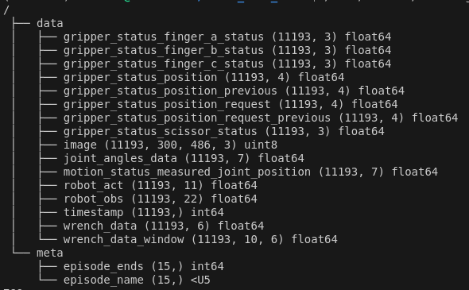
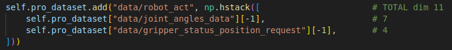
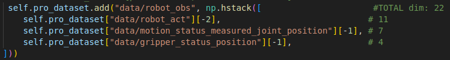

# Dataset format
Example:



### data
**data** group contains all the required data for training. Each array within it must have the same # of timesteps, with the shape (# timesteps, ...)

NOTE: in our model we only use **robot_act**, **robot_obs** and **image**:
- **robot_act** - [7 commanded joint angles, finger_a_position_request, finger_b_position_request, finger_c_position_request, and scissor_position_request] -> total *11 dimensions*
- **robot_obs** - [robot_act from previous timestep, observed_joint_angles, finger_a_position, finger_b_position, finger_c_position, scissor_position] -> total *22 dimensions*
- **image** - 300x486 image for the image configuration (resolution can be changed in the config)




Additionally, the dataset stores all the constituent parts of the robot_obs and robot_act, as well as a few additional topics to simplify data loading in the future.

NOTE: there is also the **wrench_data_window**, which stores *upsampled* wrench data, where for each timestep, there is a window of some size of wrench data that occured between the timesteps. This shall be used alongside an encoder.

### meta
**meta** group contains the episode_ends array which stores what index each demonstration/episode/trajectory ended on (so in the above example it stores [789, ...]). Additionally, it stores the names of the episodes in episode_names, so that they can be matched.

# Train Commands
- Images config: ``` python train.py --config-dir=. --config-name=victor_diffusion_policy.yaml training.seed=7 training.device=cuda:0 hydra.run.dir='data/outputs/${now:%Y.%m.%d}/${now:%H.%M.%S}_${name}_${task_name}'```
- State-only config: ```python train.py --config-dir=. --config-name=victor_diffusion_policy_state.yaml training.seed=7 training.device=cuda:0 hydra.run.dir='data/outputs/${now:%Y.%m.%d}/${now:%H.%M.%S}_${name}_${task_name}'```

# Testing
Currently there is no robust testing pipeline, instead use victor_test.py to compare the model's inference against the input it was trained on

# Checkpoints

**End Affector Observations:**
- Single Trajectory, 150 epochs, state only, epsilon: ```"data/outputs/2025.07.28/16.03.40_victor_diffusion_state_victor_diff/checkpoints/epoch=0150-train_action_mse_error=0.0001035.ckpt"```
- Single Trajectory, 2025 epochs, state only, epsilon: ```"data/outputs/2025.07.28/16.39.25_victor_diffusion_state_victor_diff/checkpoints/latest.ckpt"```
- Single Trajectory, 2900 epochs, state only, sample: ```"data/outputs/2025.07.28/21.28.14_victor_diffusion_state_victor_diff/checkpoints/epoch=2900-train_action_mse_error=0.0000000.ckpt"```
